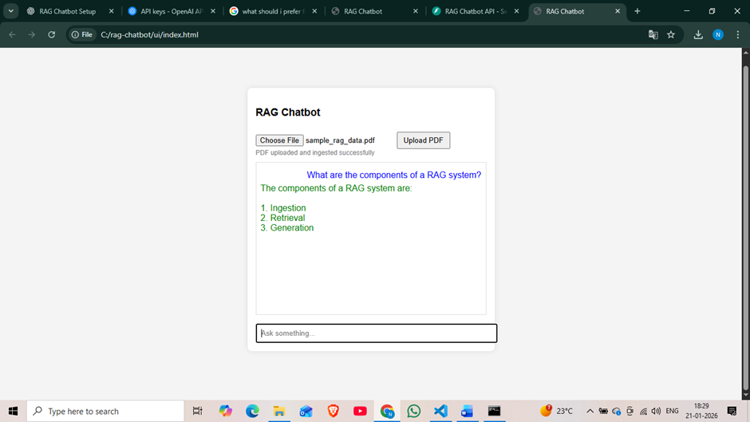
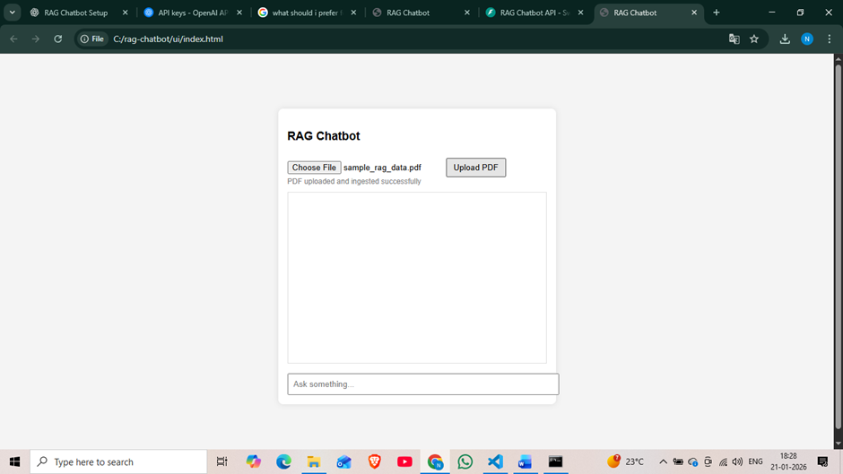

# 🤖 RAG Chatbot (Retrieval-Augmented Generation)

A **RAG-based AI chatbot** that combines **intelligent document retrieval** with **LLM reasoning** to deliver accurate, context-aware answers grounded in custom data.

---

## 📌 Overview

This project implements a **Retrieval-Augmented Generation (RAG)** pipeline where user queries are first enriched with relevant context retrieved from a document store and then passed to a Large Language Model for precise response generation.

The chatbot is designed to reduce hallucinations by ensuring responses are backed by real, retrieved data.

Functional UI Screenshot



---

## ✨ Features

- Intelligent document retrieval using embeddings  
- Context-aware answers grounded in custom documents  
- Integration with LLM API for natural language responses  
- Fast and scalable architecture  
- Clean backend pipeline for data ingestion, embedding, and querying  
- Easy to extend with new documents  

---

## 🏗️ Tech Stack

- **Programming Language:** Python  
- **LLM:** API-based Large Language Model  
- **Vector Database:** ChromaDB  
- **Embeddings:** Text / sentence embeddings  
- **Backend:** Python  
- **Frontend:** Simple web-based UI  

---

## 📂 Project Structure

```
RAG-Chatbot/
│── data/                 # Sample documents (PDF / text)
│── chroma_db/            # Vector database (local)
│── ui/                   # Frontend files
│── requirements.txt      # Project dependencies
│── .gitignore
│── main.py / app.py      # Application entry point
```

---

## ⚙️ Setup & Installation

### 1️⃣ Clone the repository
```bash
git clone https://github.com/Nik-99WEB/RAG-Chatbot.git
cd RAG-Chatbot
```

### 2️⃣ Create & activate virtual environment
```bash
python -m venv venv
source venv/Scripts/activate   # Windows (Git Bash)
```

### 3️⃣ Install dependencies
```bash
pip install -r requirements.txt
```

### 4️⃣ Set environment variables
Create a `.env` file in the project root:
```env
API_KEY=your_api_key_here
```

> ⚠️ Do not upload `.env` to GitHub.

---

### 5️⃣ Run the chatbot
```bash
python main.py
```

---

## 🧠 How It Works

1. Documents are ingested and converted into embeddings  
2. Embeddings are stored in a vector database  
3. User queries are embedded and matched with relevant documents  
4. Retrieved context is passed to the LLM  
5. The LLM generates a grounded, accurate response  

---

## 🚀 Use Cases

- Document-based Question Answering  
- Internal knowledge assistants  
- AI-powered customer support  
- Research and study assistants  

---

## 📌 Future Improvements

- Authentication & user management  
- Improved UI/UX  
- Support for multiple document uploads  
- Cloud deployment (AWS / GCP / Vercel)  

---

## 👤 Author

**Nikhil Kumar Jaiswal**  

Built as a learning-focused AI project to understand **LLM + Retrieval-Augmented Generation (RAG)** architecture.

---

⭐ If you find this project useful, feel free to star the repository!
